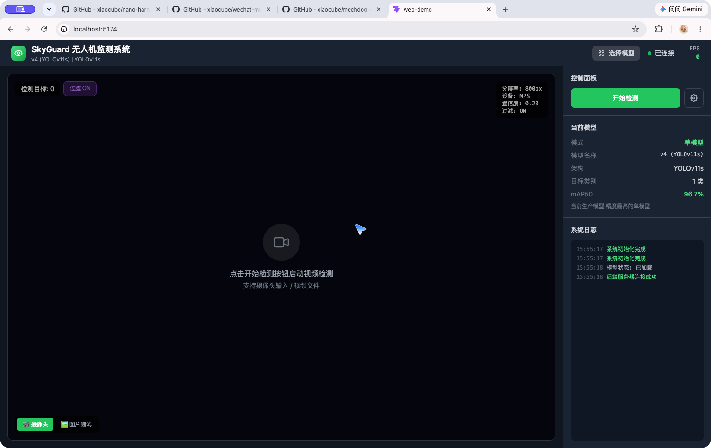
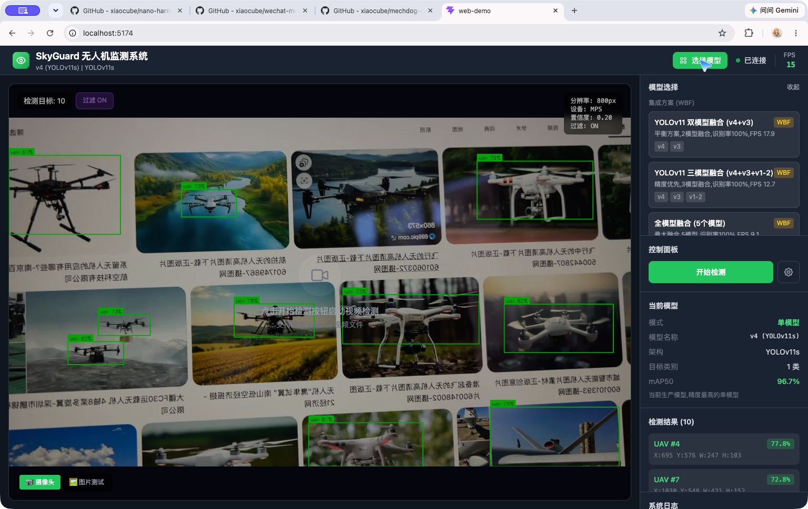
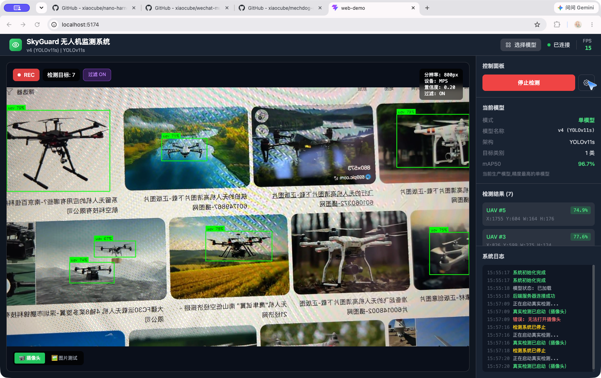

# SkyGuard

> **AI Low-Altitude Intelligent Monitoring Platform** — 面向合法低空空域监测场景的无人机目标识别 / 跟踪 / 记录 / 预警平台。
> ⚖️ 严格遵守当地法规：仅提供被动"监测"能力（detect · track · record · alert），**不包含任何主动反制能力**（无激光、无电磁干扰、无 GPS 欺骗等）。

---

## 目录

- [1. 项目简介](#1-项目简介)
- [2. 核心特性](#2-核心特性)
- [3. 量化概览](#3-量化概览)
- [4. 系统架构](#4-系统架构)
- [5. 目录结构](#5-目录结构)
- [6. 快速开始](#6-快速开始)
- [7. 模型（独立说明）](#7-模型独立说明)
- [8. 训练数据（独立说明·开发者自行下载）](#8-训练数据独立说明开发者自行下载)
- [9. Web 端使用指南](#9-web-端使用指南)
- [10. 开发与测试](#10-开发与测试)
- [11. 部署](#11-部署)
- [12. 工程规范与经验](#12-工程规范与经验)
- [13. 路线图](#13-路线图)
- [14. 合规与安全](#14-合规与安全)
- [15. 许可证](#15-许可证)

---

## 1. 项目简介

SkyGuard 使用 **YOLOv11 目标检测 + ByteTrack 跟踪 + WBF 多模型集成**，实现低空无人机目标的实时识别与监测，面向安防巡逻、机场净空、活动安保、敏感区域监测等合法场景。

| 项目 | 内容 |
|---|---|
| 核心算法 | YOLOv11s 检测（v4 生产模型）＋ ByteTrack 跟踪 ＋ WBF 加权框融合 |
| 开发环境 | macOS Apple M4 · MPS（Metal Performance Shaders）· Python 3.9-3.12 |
| 生产环境 | NVIDIA Jetson（TensorRT）· CPU/GPU Docker |
| Web 架构 | React（Vite）前端 ＋ Flask（REST API / WebSocket）后端 |
| 代码规模 | ≈42,700 行 Python（核心库 10 大子模块） |

## 2. 核心特性

- **检测**：YOLOv11 系列模型（n/s 两档），小目标检测优化，单模型 mAP50 96.7%
- **集成**：WBF 多模型加权框融合，200 样本实测**识别率 100%**，支持异构模型组合
- **跟踪**：ByteTrack 多目标跟踪，稳定 ID 关联
- **双模式**：Web 端支持图片测试（上传/示例）与实时视频检测（摄像头/视频流）
- **边缘部署**：ONNX / TorchScript / CoreML 导出，Jetson TensorRT 推理适配
- **工程化**：279 个测试用例、CI 四流水线、Docker 双镜像、pre-commit 质量门

## 3. 量化概览

| 指标 | 数值 |
|---|---|
| 📦 核心代码 | ≈42,700 行 Python（10 大子模块） |
| 🧪 测试 | 279 个用例 / 21 个文件 |
| 🎯 检测模型 | YOLOv11s · mAP50 **0.965-0.967** · Recall **0.956** |
| 🧠 集成推理 | WBF 三模型 · 样本识别率 **100%** |
| 🗂️ 训练数据集 | 8,318 张标注图像（train 5,821 / val 1,664 / test 833） |
| 🚀 推理性能 | 21.4 FPS 单模型 / 12.8 FPS WBF（MPS） |
| 🖥️ 部署目标 | Apple Silicon（MPS）· NVIDIA Jetson（TensorRT） |
| ⚙️ 工程设施 | Docker ×2 · CI 4 流水线 · 安全审计 · 代码质量门 |

## 4. 系统架构

```
┌─────────────────────────── Web 演示层 ───────────────────────────┐
│  React (Vite) 前端  ←─WebSocket/API─→  Flask 后端 (server/app.py) │
└───────────────────────────────────────────────────────────────────┘
┌─────────────────────────── 应用层 ────────────────────────────────┐
│  src/skyguard/                                                    │
│  ├── vision/    检测 / 跟踪 / 标注 / 视频流                       │
│  ├── inference/ 推理后端抽象（YOLO/ONNX）                         │
│  ├── training/  训练 / 评估 / 导出                                │
│  ├── ptz/       PTZ 云台控制（ONVIF）                             │
│  ├── edge/      Jetson 边缘部署（TensorRT / 电源 / 监控）          │
│  ├── api/       Web 后台 API                                      │
│  ├── db/        事件数据库                                        │
│  ├── data/      数据集处理 / 增强 / 清洗                          │
│  └── core/      配置 / 日志 / 异常                                │
└───────────────────────────────────────────────────────────────────┘
┌─────────────────────────── 推理引擎 ──────────────────────────────┐
│  YOLOv11 (Ultralytics) · MPS / CUDA / TensorRT · WBF 集成         │
└───────────────────────────────────────────────────────────────────┘
```

## 5. 目录结构

仓库精简为 **README + 核心代码**（模型权重与训练数据集不随仓库分发，见 §7 / §8）：

```
uav-monitoring/
├── README.md                  # 唯一文档：本文件
├── LICENSE                    # MIT License
├── screenshots/               # Web Demo 实测截图（README 引用）
├── src/skyguard/              # ★ 核心代码（10 大子模块）
├── scripts/                   # ★ 训练 / 评估 / 推理 / 部署脚本
├── tests/                     # ★ pytest 测试（21 文件 / 279 用例）
├── web-demo/                  # ★ Web 演示（React + Flask）
├── config/                    # 训练 / 推理配置（YAML）
├── .github/workflows/         # CI 流水线（4 条）
├── models/                    # 模型目录占位（权重自行获取，见 §7）
├── data/                      # 数据目录占位（数据集自行下载，见 §8）
├── logs/                      # 日志目录
├── Dockerfile / Dockerfile.jetson / docker-compose.yml
├── requirements*.txt / pyproject.toml / Makefile
├── .env.example / .gitignore / .pre-commit-config.yaml
└── start_skyguard.sh          # 服务一键启动
```

## 6. 快速开始

### 6.1 环境要求

- Python 3.9-3.12（开发机 macOS Apple Silicon / Linux GPU）
- 可选：NVIDIA Jetson（生产部署）
- 依赖安装：`pip install -r requirements.txt`（开发另加 `requirements-dev.txt`）

### 6.2 启动 Web Demo

```bash
cd web-demo
bash start.sh                # 一键启动：后端 :5001 + 前端 :5173(被占用时自动 +1)
# 浏览器访问 http://localhost:5174
```

启动后前端自动连接后端（右上角显示 **已连接**），并加载生产模型 v4。

### 6.3 CLI 实时检测

```bash
# 单模型 (v4)
.venv/bin/python scripts/webcam_demo.py --conf 0.2 --imgsz 640

# 三模型 WBF 集成（推荐，识别率 100%）
.venv/bin/python scripts/ensemble_wbf.py --webcam
.venv/bin/python scripts/ensemble_wbf.py --webcam --models v4 v3 v1-2

# 快捷键: +/- 调 conf，[/] 调 iou，，/. 调 wbf，i 切 imgsz，t 切多模型一致，s 截图，q 退出
```

### 6.4 训练与评估

```bash
bash scripts/train/train_uav_v4.sh            # 训练（或 --resume 续训）
.venv/bin/python scripts/evaluate_uav.py      # 验证集评估
.venv/bin/python scripts/ensemble_wbf.py --eval --compare   # 集成评估/对比
.venv/bin/python scripts/deploy_inference.py  # 导出 ONNX/TorchScript/CoreML
```

> ⚠️ 训练安全停止：按 `Ctrl+C`（自动保存 `last.pt`），禁止直接关闭终端。
> 监控：`tensorboard --logdir runs/detect/train/uav-v4`

## 7. 模型（独立说明）

模型权重文件（`.pt` / `.onnx`）体积较大，**不随仓库分发**（仓库内 `models/` 为占位目录）。开发者可通过以下任一方式获取：

1. **自行训练**：按 §8 准备数据，运行 `scripts/train/train_uav_v4.sh`；
2. **开源渠道**：使用 Ultralytics 官方预训练权重初始化，再在自有数据上微调；
3. **联系作者**：项目维护者可提供 v4 生产模型（18MB）与 WBF 集成权重。

### 7.1 模型版本历史

| 版本 | 架构 | 数据集 | mAP50 | mAP50-95 | Precision | Recall | 状态 |
|---|---|---|---|---|---|---|---|
| v1-2 | YOLO11n (3M) | skyguard-v1 | 0.977 | 0.627 | 0.977 | 0.941 | 归档 |
| v3 | YOLO11s (9.4M) | skyguard-v2 | 0.966 | 0.627 | 0.954 | 0.956 | 归档 |
| **v4（当前）** | YOLO11s (9.4M) | skyguard-v2 | **0.967** | 0.622 | 0.953 | **0.956** | 生产 |
| **WBF 集成** | v4+v3+v1-2 | — | — | — | — | **100%*** | 最佳 |

*\*WBF 集成在 200 张样本测试中识别率 100%（vs 单模型 99.5%），多模型一致率 82.3%。*

### 7.2 WBF 集成方案（推荐）

- **脚本**：`scripts/ensemble_wbf.py` —— 多模型分别推理，预测框加权融合
- **组合**：v4（权重 1.0）+ v3（权重 1.0）+ v1-2（权重 0.8）
- **性能**：FPS 12.8（三模型）vs 21.4（单 v4）；支持异构架构模型，精度最高
- **Web 端方案**：双模型融合（v4+v3，FPS 17.9）｜ 三模型融合（FPS 12.7）｜ 全模型融合 5 模型（FPS 9.1），识别率均 100%

> 权重平均（SWA）方案因 YOLO 的 BN 统计量冲突**不可行**，已保留为实验代码（`scripts/ensemble_weights.py`）。

### 7.3 v4 训练配置（关键配方）

v4 相比 v3 的关键修正（恢复 v1-2 成功配方）：

```yaml
lr0: 0.001          # v3 的 0.01 → 0.001（降低 10 倍）
optimizer: AdamW    # v3 的 auto → AdamW
degrees: 5.0        # 恢复角度增强
shear: 2.0          # 恢复剪切增强
mixup: 0.1          # 恢复混合增强
batch: 16
iou: 0.6
epochs: 50          # 实际 epoch 45 达最佳，之后震荡
```

### 7.4 推理参数推荐

| 模式 | imgsz | conf | iou | FPS | 适用场景 |
|---|---|---|---|---|---|
| 均衡 | 640 | 0.2 | 0.6 | 15-20 | 日常使用 |
| 精度 | 800 | 0.15 | 0.6 | 7-10 | 远距离小目标 |
| 速度 | 640 | 0.25 | 0.5 | 20-30 | 实时性要求高 |
| 集成 | 640 | 0.2 | 0.6 | 12-15 | 最高精度 |

## 8. 训练数据（独立说明·开发者自行下载）

训练数据集（约 550MB / 8,318 张）**不随仓库分发**，仓库内 `data/` 为占位目录。

### 8.1 数据集规格

| 项目 | 说明 |
|---|---|
| 名称 | skyguard-v2（当前）／ skyguard-v1（历史） |
| 规模 | **8,318 张**标注图像（JPG + YOLO txt 标签） |
| 划分 | train 5,821 / val 1,664 / test 833 |
| 类别 | 1 类（uav） |
| 标注格式 | YOLO（`class x_center y_center w h`），`dataset.yaml` 声明路径 |

### 8.2 获取方式

```bash
# 方式一：Roboflow 公开数据集（原始数据源之一）
# 在 Roboflow Universe 搜索 "drone detection" / "uav" 数据集，导出 YOLOv11 格式

# 方式二：公开论文数据集 DroneTrack / UAVDT / Drone-vs-Bird 等
# 下载后按 YOLO 格式转换（scripts/ 下提供转换/清洗脚本）

# 方式三：自行采集标注
# 使用 scripts/ 标注辅助脚本 + 数据增强（degrees/shear/mixup），
# 参考 config/training/uav_v4.yaml 构建训练集
```

### 8.3 数据目录约定（自行构建后）

```
data/skyguard-v2/
├── train/images/  (5,821 张)
├── train/labels/
├── val/images/    (1,664 张)
├── val/labels/
├── test/images/   (833 张)
└── dataset.yaml
```

## 9. Web 端使用指南

### 9.1 界面布局（四区）

| 区域 | 内容 |
|---|---|
| 顶部栏 | 系统标题、当前模型、`选择模型`、连接状态、实时 FPS |
| 视频监测区 | 实时/检测画面 + REC 角标 + 检测目标数 + 参数角标 |
| 控制面板 | `开始检测`、`⚙️ 参数设置`、模式切换（📹 摄像头 / 🖼️ 图片测试） |
| 信息面板 | `当前模型`、`检测结果`、`系统日志` |



### 9.2 参数设置（⚙️）

| 参数 | 默认 | 范围 | 说明 |
|---|---|---|---|
| 置信度阈值 | 0.20 | 0.10-0.90 | 过滤低置信度框 |
| IOU 阈值 | 0.50 | 0.10-0.90 | NMS 去重 |
| 输入分辨率 | 800px | 320-1280 | 精度/速度权衡 |
| 推理设备 | MPS | CPU/MPS/CUDA | 按硬件选择 |
| 后处理过滤 | ON | 开/关 | 尺寸/宽高比/置信度规则 |

### 9.3 模型选择

- **WBF 集成方案**：双模型（v4+v3，100%，17.9 FPS）／ 三模型（100%，12.7 FPS）／ 全模型 5 个（100%，9.1 FPS）
- **单模型**：v4（YOLOv11s，推荐）／ v3 ／ v1-2 ／ v8-v1 ／ v8-v2（2 类需过滤）



### 9.4 检测模式

- **图片测试**：上传本地图片或 6 张内置示例（单/多目标），输出检测框 + 置信度 + 坐标 + 日志全流程
- **实时检测**：`开始检测` 启动视频流，REC + 实时 FPS + 动态检测框 + 结果列表实时刷新
- **WBF 集成模式**：切换后画面出现 `WBF 集成模式` 标签与 `WBF IoU` 参数，mAP50 显示 100% (eval)

　

完整实测截图见 [screenshots/](screenshots/)（参数面板、图片测试、检测结果等 9 张）。

## 10. 开发与测试

### 10.1 测试

```bash
pytest tests/ -v              # 279 个用例 / 21 个文件
```

覆盖：vision / api / db / edge / ptz / training / data / config / inference。

### 10.2 CI（GitHub Actions）

| 流水线 | 内容 |
|---|---|
| Lint & Test | black + isort + flake8 + mypy + pytest（Python 3.10-3.12 矩阵），Coverage 上报 Codecov |
| Security | bandit + pip-audit 依赖漏洞扫描 |
| Docker | Dockerfile / Dockerfile.jetson 构建验证 |
| Release | 版本发布自动化 |

### 10.3 代码规范

- 格式：black + isort；静态检查：flake8 + mypy；提交前 pre-commit 全量校验
- 路径命名：生产模型 `models/current/best_vX.pt`；训练输出 `runs/detect/train/uav-vX/`；配置 `config/training/uav_vX.yaml`

## 11. 部署

### 11.1 Docker

```bash
docker compose up -d            # CPU/GPU 版本
docker build -f Dockerfile.jetson -t skyguard-jetson .   # Jetson 版本
```

### 11.2 NVIDIA Jetson（生产）

- `src/skyguard/edge/`：TensorRT 推理、电源管理、设备监控
- 依赖：`requirements.jetson.txt`（含 tensorrt、jetpack 版本适配）

## 12. 工程规范与经验

1. **训练数据集必须本地存储**（iCloud 自动 eviction 会中断训练）
2. **Mac MPS 不支持进程暂停/恢复**：只能优雅终止（Ctrl+C）+ 续训
3. **低学习率 (0.001) + 数据增强 (degrees/shear/mixup) 是 v4 超越 v3 的关键**
4. **训练轮数并非越多越好**：v4 在 epoch 45 达最佳后开始震荡
5. **WBF 是多模型集成最佳方案**：支持异构模型；SWA 因 BN 冲突不可行
6. **v1-2 单独识别率最低，但在集成中互补性最强**（不同数据集训练）
7. **选择 YOLOv11s 而非 YOLOv8**：小目标检测更优；**MPS 而非 CPU**：M4 GPU 加速 3-5 倍

## 13. 路线图

| Sprint | 主题 | 状态 |
|---|---|---|
| 1-4 | 环境骨架 / YOLO 检测 / 数据集制作 / 自有模型训练 | ✅ 完成 |
| 5 | 模型优化（TensorRT / ONNX / 量化） | ✅ 完成 |
| 6-7 | 实时视频流检测 / ByteTrack 目标跟踪 | ✅ 完成 |
| 8 | PTZ 自动控制（ONVIF 已实现） | 🚧 进行中 |
| 9 | Web 后台（API / WebSocket / 前端已实现） | 🚧 进行中 |
| 10-12 | 数据库 / Jetson 边缘部署 / 工业产品化 | 🚧 待推进 |

## 14. 合规与安全

- 本项目仅提供**被动监测**能力（识别、跟踪、记录、预警），**不含**任何主动反制功能（激光、电磁干扰、GPS 欺骗等）
- 请在**合法授权**下使用（如自有空域、持证安防、净空巡查），遵守所在地法律法规
- 涉及他人隐私的监控场景需提前取得合法授权

## 15. 许可证

[MIT License](LICENSE) © 2026 xiaocube
