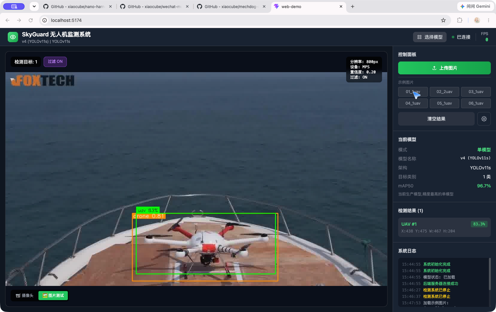

# SkyGuard

> **AI Low-Altitude Intelligent Monitoring Platform** — 合法场景下的低空目标识别 / 跟踪 / 记录 / 预警。
> 严格遵守当地法规：仅做"监测"（detect · track · record · alert），不涉及任何主动反制能力（无激光、无电磁干扰、无 GPS 欺骗等）。

---

## 0. 项目量化概览

| 指标 | 数值 |
|---|---|
| 📦 核心代码 | ≈ 42,700 行 Python（10 大子模块） |
| 🧪 测试 | 279 个用例 / 21 个文件（CI 全覆盖） |
| 🎯 检测模型 | YOLO11s · mAP50 **0.965** · Recall **0.956** |
| 🧠 集成推理 | WBF 三模型 · 样本识别率 **100%** |
| 🗂️ 训练数据集 | 8,318 张标注图像（train 5,821 / val 1,664 / test 833） |
| 🚀 推理性能 | 21.4 FPS 单模型 / 12.8 FPS WBF（MPS） |
| 🖥️ 部署目标 | Apple Silicon（MPS）· NVIDIA Jetson（TensorRT） |
| ⚙️ 工程设施 | Docker ×2 · CI 4 流水线 · 安全审计 · 代码质量门 |

> 完整量化明细见 [PROJECT_STATS.md](./PROJECT_STATS.md)。

---

## 0.1 Web Demo 实测截图

YOLOv11s 单模型在示例图片上的实时检测效果（置信度 83.3%，MPS 推理）：



> 📖 **完整 Web 端操作界面与实时测试介绍书见 [docs/PROJECT_INTRO.md](docs/PROJECT_INTRO.md)**（含全部操作界面截图与功能说明）

---

## 1. 是什么 / 不是什幺

| 我们做 ✅ | 我们不做 ❌ |
|---|---|
| AI 目标检测 / 分类 / 跟踪 | 主动击落 / 干扰 / 捕获 |
| 摄像机自动跟踪（PTZ） | 武器化 / 反制硬件 |
| 自动录像 / 事件回放 | 通讯压制 / GPS 欺骗 |
| Web 后台 / 地图 / 报警推送 | 任何破坏性能力 |

## 2. 应用场景

工业园区 · 光伏电站 · 风电场 · 景区 · 仓储物流园 · 校园 · 科研机构

## 3. 技术栈

* **语言**：Python 3.10–3.12（Mac 端使用 MPS；Linux 端可启用 CUDA）
* **AI**：PyTorch 2.1+, Ultralytics YOLOv8, torchvision, OpenCV 4.8+
* **跟踪**：ByteTrack（默认）/ DeepSORT / BoT-SORT
* **工程**：pydantic-settings, loguru, PyYAML, Rich, Typer
* **数据格式**：Pydantic v2 `Detection` / `DetectionResult`，可直接序列化为 JSON
* **部署**：Docker / docker-compose, NVIDIA Jetson（生产），Apple Silicon（开发）

## 4. 目录结构

```
.
├── config/                 # YAML 层级化配置（default + env 覆盖）
├── src/skyguard/
│   ├── core/               # config / logger / exceptions
│   ├── utils/              # device / environment
│   ├── vision/             # detector / classes / annotate / stream
│   └── main.py             # CLI 入口
├── scripts/                # 环境引导、验证、benchmark、demo
├── tests/                  # pytest 测试
├── data/                   # 数据集（gitignored）
├── models/                 # 模型权重（gitignored）
├── logs/                   # 运行日志
├── .github/workflows/      # CI
├── Dockerfile
├── docker-compose.yml
├── Makefile
├── pyproject.toml
├── requirements.txt
└── requirements-dev.txt
```

## 5. 快速开始（macOS / Linux）

```bash
# 1) 拉项目并进入
cd /path/to/SkyGuard

# 2) 一键引导环境（dev 模式，含 lint/test 依赖 + pre-commit）
bash scripts/setup_env.sh

# 3) 激活虚拟环境
source .venv/bin/activate

# 4) 验证安装
python scripts/verify_install.py

# 5) 跑测试
pytest -q

# 6) 跑 CLI
skyguard info
skyguard bench
skyguard verify
skyguard detect /path/to/image.jpg --show
skyguard detect /path/to/video.mp4 -o output.mp4
```

### macOS 开发注意

首次使用 PyTorch / Ultralytics 前，请安装 Xcode Command Line Tools：

```bash
xcode-select --install
```

若出现 `xcode-select: note: No developer tools were found` 提示，说明尚未安装；安装后所有 `python` / `pytest` 命令即可正常执行。

## 6. 配置约定

* 默认值在 `config/default.yaml`。
* 不同环境用 `config/{development,staging,production}.yaml` 覆盖。
* 运行时可用 `SKYGUARD_*` 环境变量覆盖任何键（双下划线进入嵌套段），例：
  `SKYGUARD_COMPUTE__DEVICE=mps skyguard info`

## 7. 研发路线图（Sprint Plan）

| Sprint | 主题 | 状态 |
|---|---|---|
| 1 | AI 开发环境 + 工程骨架 | ✅ |
| 2 | YOLO 目标检测基础 | ✅ |
| 3 | 无人机数据集制作 | ✅ |
| 4 | 自有模型训练 | ✅ |
| 5 | 模型优化（TensorRT / ONNX / 量化） | ✅ |
| 6 | 实时视频流检测 | ✅ |
| 7 | ByteTrack 目标跟踪 | ✅ |
| 8 | PTZ 自动控制（ONVIF 客户端 / 跟踪控制器已实现） | 🚧 进行中 |
| 9 | Web 后台（REST API / WebSocket / 前端已实现） | 🚧 进行中 |
| 10 | 数据库 / 事件流 | ⏳ |
| 11 | Jetson 边缘部署 | ⏳ |
| 12 | 工业产品化 | ⏳ |

## 8. 合规与安全

SkyGuard 仅用于合法合规的低空空域监测与预警。禁止用于：
* 任何形式的反制、干扰、击落、捕获
* 隐私侵犯、未授权监控
* 任何违反当地法律法规的用途

使用本项目的衍生产品/代码时，请遵守所在司法管辖区的所有适用法律。
