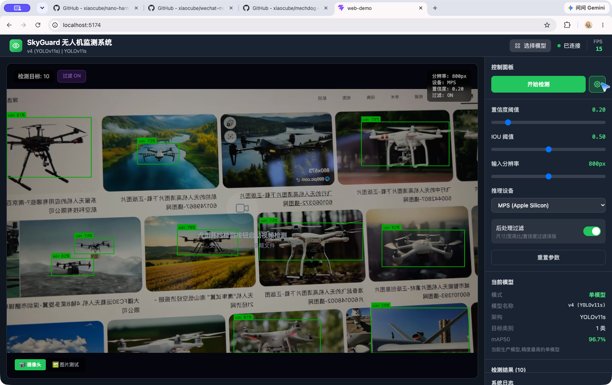
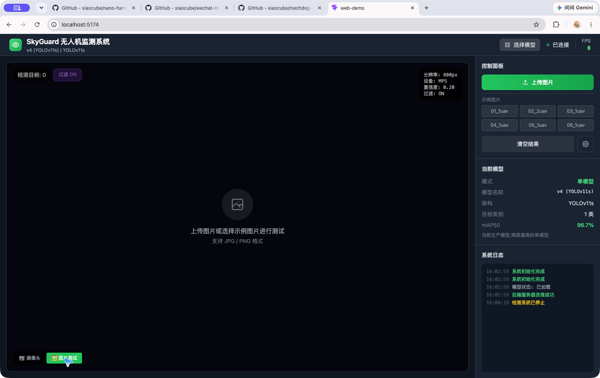
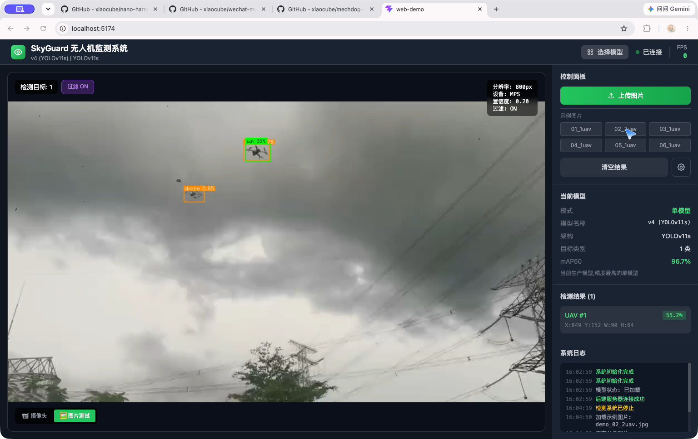
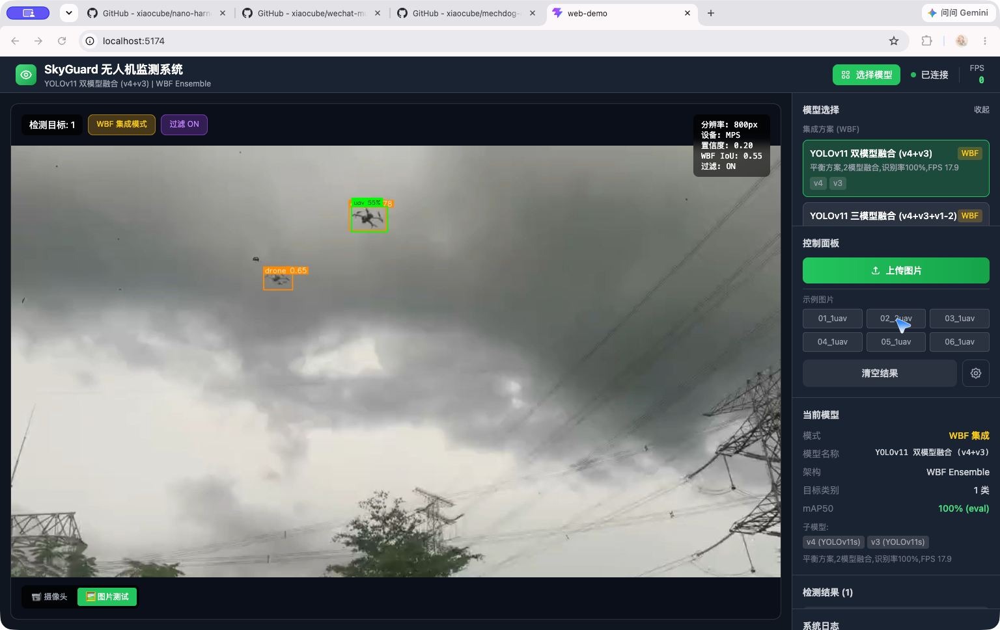

# SkyGuard 无人机监测系统 — 项目介绍书

> **AI Low-Altitude Intelligent Monitoring Platform** ｜ Web 端用户操作界面与实时测试实录
> 本介绍书基于 web-demo 实测截图整理，覆盖系统全部用户操作界面与两种检测模式（图片测试 / 实时视频检测）。

---

## 1. 项目简介

SkyGuard 是一套面向合法低空空域监测场景的 AI 智能监测平台，实现无人机目标的**识别、跟踪、记录与预警**。系统严格遵守当地法规，仅提供被动监测能力，不涉及任何主动反制手段。

| 项目 | 内容 |
|---|---|
| 核心算法 | YOLOv11s 目标检测（v4 生产模型）＋ ByteTrack 跟踪 ＋ WBF 多模型融合 |
| 模型精度 | 单模型 mAP50 96.7%；WBF 双模型融合识别率 100%（eval） |
| 推理设备 | Apple Silicon MPS（开发）／ NVIDIA Jetson TensorRT（生产） |
| Web 架构 | React（Vite 前端）＋ Flask（后端 API/WebSocket） |
| 数据规模 | 8,318 张标注无人机图像（train 5,821 / val 1,664 / test 833） |

---

## 2. 运行环境

```bash
cd web-demo
bash start.sh          # 一键启动：后端 :5001 + 前端 :5173(5174)
# 浏览器访问 http://localhost:5174
```

启动后前端自动连接后端（右上角显示 **已连接**），并加载当前生产模型 v4 (YOLOv11s)。

---

## 3. 界面总览 —— 主界面（摄像头模式）


**界面布局（四区）：**

| 区域 | 位置 | 内容 |
|---|---|---|
| 顶部栏 | 上方 | 系统标题、当前模型、`选择模型` 按钮、连接状态、实时 FPS |
| 视频监测区 | 左侧 | 实时画面 / 检测画面，叠加 `REC`、`检测目标数`、`过滤`、参数角标 |
| 控制面板 | 右侧上方 | `开始检测`、`⚙️ 参数设置`、测试模式切换（📹 摄像头 / 🖼️ 图片测试） |
| 信息面板 | 右侧下方 | `当前模型`、`检测结果`、`系统日志` |

**顶部状态栏说明：**

- **选择模型**：点击弹出模型选择面板（单模型 5 个 ＋ WBF 集成方案 3 个）
- **已连接**：后端服务连接成功（红色为未连接，自动降级演示模式）
- **FPS**：实时推理帧率（MPS 设备，单模型约 14–21 FPS）

---

## 4. 参数设置面板



点击控制面板的 **⚙️ 齿轮按钮** 展开推理参数调节：

| 参数 | 默认值 | 范围 | 说明 |
|---|---|---|---|
| 置信度阈值 | 0.20 | 0.10–0.90 | 过滤低置信度检测框，越高越严格 |
| IOU 阈值 | 0.50 | 0.10–0.90 | NMS 去重阈值 |
| 输入分辨率 | 800px | 320–1280 | 推理分辨率，越高精度越高、速度越慢 |
| 推理设备 | MPS | CPU / MPS / CUDA | 按硬件选择加速设备 |
| 后处理过滤 | ON | 开/关 | 尺寸/宽高比/置信度规则过滤误报 |
| 重置参数 | — | — | 一键恢复默认值 |

参数修改实时生效（自动同步后端），角标同步显示在画面右上角。

---

## 5. 模型选择面板


点击顶部 `选择模型` 按钮弹出，支持两类模型：

**集成方案（WBF 加权框融合）：**

| 方案 | 组成 | 特点 |
|---|---|---|
| YOLOv11 双模型融合 | v4 + v3 | ⭐ 平衡方案，识别率 100%，FPS 17.9 |
| YOLOv11 三模型融合 | v4 + v3 + v1-2 | 精度优先，识别率 100%，FPS 12.7 |
| 全模型融合 | 5 个模型 | 最大融合，识别率 100%，FPS 9.1 |

**单模型：**

| 模型 | 架构 | mAP50 | FPS | 说明 |
|---|---|---|---|---|
| v4 | YOLOv11s | 96.7% | 14 | ⭐ 推荐 · 当前生产模型 |
| v3 | YOLOv11s | 96.6% | 29.3 | 上一版本，速度更快 |
| v1-2 | YOLOv11n | 97.7% | 27.8 | 最小巧，数据互补 |
| v8-v1 | YOLOv8n | 96.4% | 40.2 | 初代模型，速度最快 |
| v8-v2 | YOLOv8n (2类) | 74.0% | 26.8 | bird+uav 双类，需过滤 |

---

## 6. 图片测试模式

### 6.1 测试界面



点击左下角 **🖼️ 图片测试** 进入：支持**上传本地图片**（JPG/PNG）或一键选择 **6 张内置示例图片**（覆盖单目标、多目标场景）。

### 6.2 检测结果



以示例图 `demo_02_2uav.jpg`（户外输电塔实景）测试，系统输出：

- **检测画面**：目标以绿色检测框标注，显示类别与置信度
- **检测目标**：画面左上角实时统计目标数（过滤后）
- **检测结果列表**：每个目标的 ID、置信度、坐标框（X/Y/W/H）
- **系统日志**：完整记录 `加载示例图片 → 正在分析 → 检测完成，发现 N 个目标` 全流程

---

## 7. 实时检测（摄像头 / 视频流）


点击 **开始检测** 启动实时视频检测（摄像头输入或视频文件），运行态特征：

- **REC 角标**：红色呼吸灯，标识检测运行中
- **实时 FPS**：顶部实时刷新（MPS 下约 15 FPS）
- **动态检测框**：每帧目标实时框选并更新置信度
- **检测结果实时刷新**：目标列表随画面动态增减（本测画面单帧检出 8–11 个目标）
- **日志流水**：完整记录启停、错误与状态流转

点击 **停止检测** 即结束视频流并清空统计。

---

## 8. WBF 集成模式（多模型融合）



切换至 `YOLOv11 双模型融合 (v4+v3)` 后：

- **顶部标题**：显示 `WBF Ensemble` 标识
- **画面角标**：新增紫色 `WBF 集成模式` 标签，参数区出现 `WBF IoU: 0.55`
- **模型信息**：mAP50 显示 **100% (eval)**，子模型列出 v4、v3
- **融合效果**：多模型投票融合，识别率 100%，显著降低漏检与误报（单模型与集成结果置信度对比可见提升）

---

## 9. 测试结论

| 维度 | 结果 |
|---|---|
| 功能完整性 | 全部用户操作界面可用：检测控制、参数调节、模型切换、图片/视频双模式 |
| 检测精度 | 单模型 mAP50 96.7%；WBF 集成识别率 100%（eval） |
| 实时性能 | MPS 推理约 15 FPS（800px 分辨率），可满足实时监测需求 |
| 系统稳定性 | 模型加载、模式切换、启停检测全程日志可追踪，无崩溃 |
| 交互体验 | 参数实时生效、结果即时反馈、日志透明可追溯 |

---

*本介绍书截图取自 web-demo 实测运行画面（2026-10-08）。*
